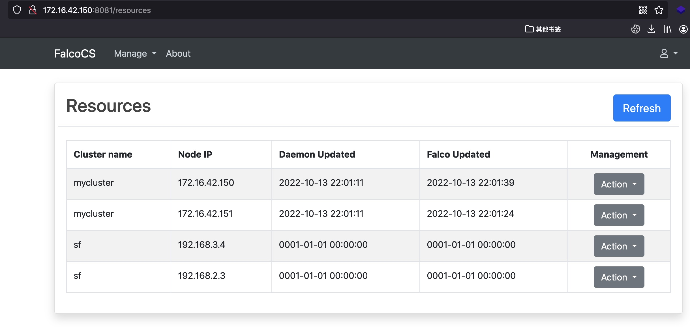
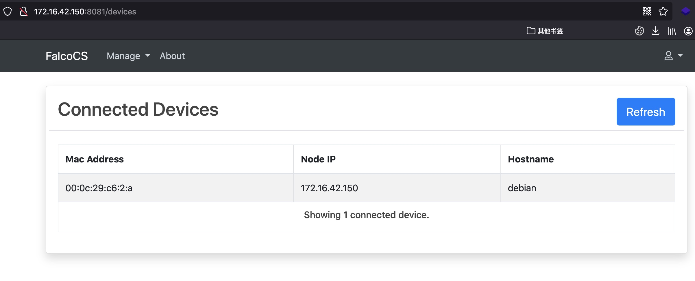

FalcoCS是一个用于管理云原生运行时安全项目[Falco](https://github.com/falcosecurity/falco)的系统。用于健康检测、规则更新、资源监控以及falco安装与更新


## Client
client安装
```
cd client
go build main.go -o client
./client
```

## Server
server运行
```
cd server
go build main.go -o server
./server
```

启动后访问http://server-ip:port/resources进行管理
路由
```
/resources  管理
/devices    在线设备
```
资源管理

<br>
<br>

在线设备



## 资产配置
在server/conf/resources.yaml配置资产
name表示集群名称
ip表示集群中节点Ip

## Update
1. 资产可见性 （已完成）
2. 在线设备可见性（已完成）
3. 在线启动/关闭/重启falco (进行中)


