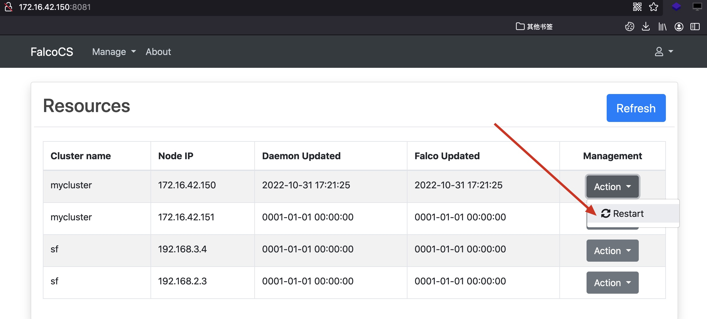

FalcoCS是一个用于管理云原生运行时安全项目[Falco](https://github.com/falcosecurity/falco)的系统。用于健康检测、规则更新、资源监控以及falco安装与更新
<br>
<br>
Client端通过HTTP请求发送健康信息。通过websocket进行下发命令，获取执行结果。
<br>
<br>
如果是手动运行falco，falco需要以以下命令运行，官方镜像默认是如下命令不用管
```
/usr/bin/falco
```

<br>
<br>


## Client
client运行
```
cd client
go run main.go
```

## Server
server运行
```
cd server
go run main.go
```

启动后访问登录：
```
http://server-ip:port/login
默认账号密码: admin/admin
```
路由
```
/resources  管理
/devices    在线设备
```
资源管理

<br>
<br>

在线设备

<br>
<br>
重启Falco



## 资产配置
在server/conf/resources.yaml配置资产
name表示集群名称
ip表示集群中节点Ip


## Client配置
在client/main.go配置服务端地址

## Server端配置
server/libs/constants.go配置

## Update
1. 资产状态 （已完成）
2. 设备状态（已完成）
3. 在线启动/关闭/重启falco (已完成)
4. 前后端分离（计划中）


